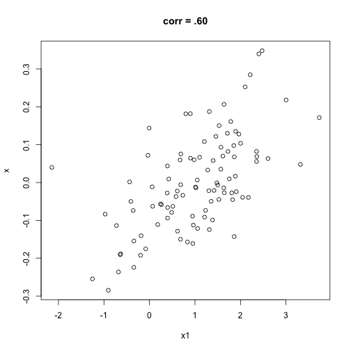
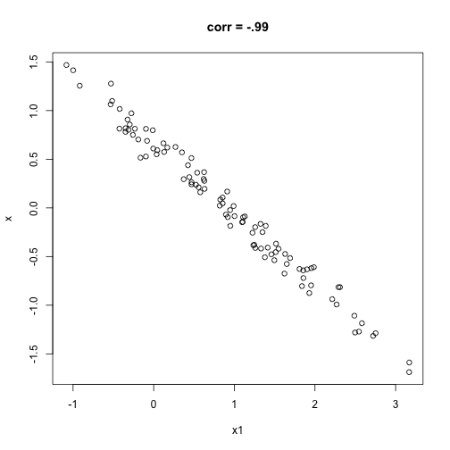
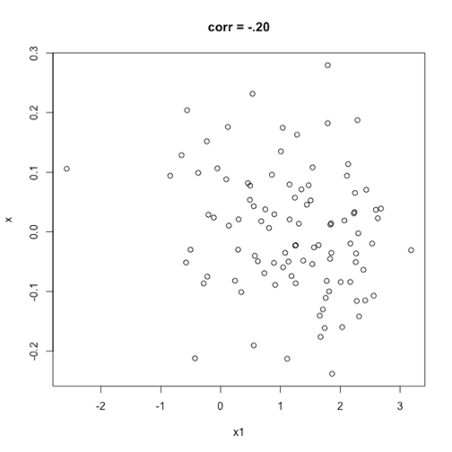

```{r setup, include=FALSE}
# Change css [here](notes_slides/slides/metropolis.css)

options(htmltools.dir.version = FALSE)
library(xaringanthemer)
library(flair)
```

# Some Foundations

### A hypothesis is a suggestion (ideally supported by theory) about how variables *tend to move together*

--

- How close or tight are the values? How well do they resemble a straight line?

--

- The spread they tend to share = covariance

--

- The change they tend to share = correlation

---

# Interpreting Correlations

### Easier to interpret correlations than covariances

--

- Always bounded by -1, 1

--

- Association is linear (for now)

--

- Positive correlation > 0

--

     - When X is larger than its mean, likely that Y is larger than its mean

--

- Negative correlation < 0

--

     - When X is larger than its mean, unlikely that Y is larger than its mean

---

# Interpreting Correlations 

### Correlation of X, Y = Correlation of Y, X

--

- But still think of axes

--

### Not affected by changes in scale

--

- Can multiply all the values by a constant and the correlation is still the same
- Temperature degrees, currencies, etc. 

--

### But can be affected by outliers

---

# Association Has Sign And Strength

### Positive correlation coefficients look like proportions but they are not

--

### Strong association: knowing a value of one variable helps predict a value of the other variable

--

### Weak association: too much variability to use the value of one variable to make a good guess about the value of the other variable 

--

### Remember: Not causal!

--

### Keep in mind: *strong* is not always *better*

---

# Strength of Associations

### No association = 0 to .19 or 0 to -.19

### Weak association = .20 to .29 or -.20 to -.29

### Moderate association = .30 to .49 or -.30 to -.49

### Strong association = .50 to .69 or -.50 to -.69

### Very strong association = greater than .70 or less than -.70

---
class: middle, center

# Scatterplots


---
class: middle, center

# Scatterplots


---
class: middle, center

# Scatterplots



---
class: middle, center

# Scatterplots


---
class: middle, center

# Scatterplots


---
class: middle, center

# Scatterplots



---
class: middle, center

# Scatterplots


---
class: middle, center

# Scatterplots


---
class: middle, center

# Scatterplots


---
class: middle, center

# Scatterplots



---

# Chetty et al's Correlations


---

# Chetty et al's Correlations

